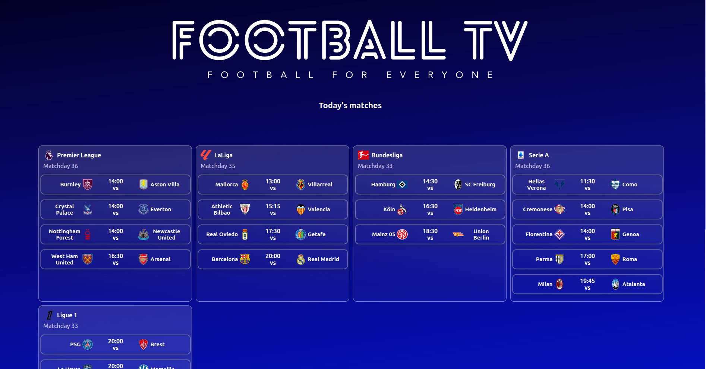
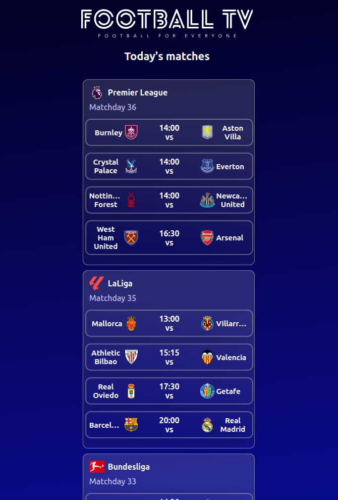

# ⚽ Football TV

<div align="center">

**Football for Everyone**

A modern web application to watch any football match from major leagues without annoying advertisement pop-ups.

[Live Demo](#) • [Features](#features) • [Installation](#installation) • [Tech Stack](#tech-stack)

</div>

---

## 📋 About

Football TV is a React-based web application that aggregates football match streams from popular streaming sites. It scrapes and curates available streams, allowing you to easily select your preferred channel without dealing with intrusive advertisements.

### 🎯 Key Benefits
- 🔍 **Stream Aggregation** - Automatically gathers streams from multiple popular streaming sites
- 🛡️ **Ad-Free Experience** - Watch matches without annoying pop-ups
- 🎨 **Clean Interface** - Intuitive and beautiful user interface
- 🔄 **Real-time Updates** - Get the latest football matches from major leagues
- 📱 **Responsive Design** - Works seamlessly on desktop and mobile

---

## 🖼️ Screenshots

### Desktop View


### Mobile View


---

## ✨ Features

- ✅ Browse today's football matches from major leagues (Premier League, La Liga, Bundesliga, Serie A, and more)
- ✅ View multiple stream sources for each match
- ✅ Search and filter matches
- ✅ Clean, ad-free stream player
- ✅ Responsive design for all devices
- ✅ Full-screen mode support

---

## 🚀 Getting Started

### Prerequisites
- Node.js (v14 or higher)
- npm or yarn

### Installation

1. **Clone the repository**
   ```bash
   git clone <repository-url>
   cd FootballTv
   ```

2. **Install dependencies for the frontend**
   ```bash
   cd football-tv
   npm install
   ```

### Running the Application

**Frontend (React app)**
```bash
cd football-tv
npm start
```
The app will open at `http://localhost:3000`

---

## 🎮 Usage

1. Open the application in your browser
2. View today's available football matches organized by league
3. Click on a match to see available streams
4. Select your preferred streaming source
5. Enjoy watching without ads!

---

## 🤝 Contributing

Contributions are welcome! Please feel free to submit a Pull Request.

---

## 📄 License

This project is licensed under the MIT License - see the LICENSE file for details.

---

<div align="center">

Made with ⚽ by the Football TV team

[⬆ back to top](#-football-tv)

</div> 
